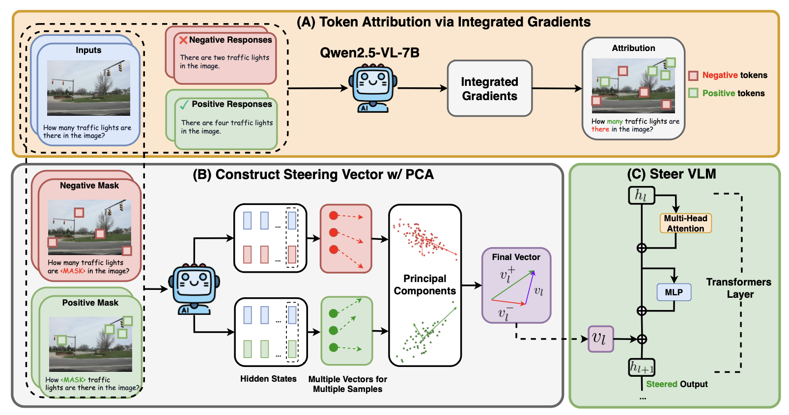

# GrAInS: Gradient-based Attribution for Inference-Time Steering

[](assets/overall.png)

**Authors:**  
[Duy Nguyen](https://duykhuongnguyen.github.io/), [Archiki Prasad](https://archiki.github.io/), [Elias Stengel-Eskin](https://esteng.github.io/), [Mohit Bansal](https://www.cs.unc.edu/~mbansal/)

This repository contains the implementation of our paper:  
**GrAInS: Gradient-based Attribution for Inference-Time Steering of LLMs and VLMs.**

---

## 🚀 Installation

This project uses **Python 3.10.11**.

Install dependencies via:

```bash
pip install -r requirements.txt
```

---

## 📁 Project Structure

```
GrAInS/
├── assets/                        # Visual assets
├── src/                           # Source code and all experiments
│   ├── data/                      # Intermediate data and hidden states
│   │   ├── llm/
│   │   └── vlm/
│   ├── results/                   # Output results
│   │   ├── llm/
│   │   └── vlm/
│   ├── scripts/                   # Bash scripts for experiments
│   │   ├── llm/
│   │   └── vlm/
│   ├── token_ablation.py          
│   ├── token_ablation_vlm.py      
│   ├── steering_mc.py             
│   ├── steering_mc_vlm.py         
│   ├── steering_generation.py     
│   ├── steering_generation_vlm.py 
├── requirements.txt
└── README.md
```

---

## ⚙️ Running GrAInS

All scripts and code should be run from the `src/` directory. Example bash scripts are provided in `src/scripts/` for both LLM and VLM setups.

---

### LLM Experiments

The following commands demonstrate how to run LLM experiments using Llama-3.1-8B-Instruct on the TruthfulQA dataset.

#### 1. Gradient Attribution & Hidden State Extraction

```bash
cd src
bash scripts/llm/run_token_ablation.sh
```

Hidden states will be saved to: `src/data/llm/hidden_states/`

#### 2. Steering for Multiple-Choice QA Tasks

```bash
bash scripts/llm/run_steering_mc.sh
```

Results will be saved to: `src/results/llm/steering/`

#### 3. Steering for Generation Tasks

```bash
bash scripts/llm/run_steering_generation.sh
```

Results will be saved to: `src/results/llm/steering_generation/`

---

### VLM Experiments

The following commands demonstrate how to run VLM experiments using LLaVA-1.6-7B on the SPA-VL dataset.

#### 1. Gradient Attribution & Hidden State Extraction

```bash
bash scripts/vlm/run_token_ablation_vlm.sh
```

Results will be saved to: `src/data/vlm/hidden_states/`

#### 2. Steering for Multiple-Choice QA Tasks

```bash
bash scripts/vlm/run_steering_mc_vlm.sh
```

Results will be saved to: `src/results/vlm/steering/`

#### 3. Steering for Generation Tasks

```bash
bash scripts/vlm/run_steering_generation_vlm.sh
```

Results will be saved to: `src/results/vlm/steering_generation/`

---

## Citation

If you find this work useful, please consider citing:

```
```